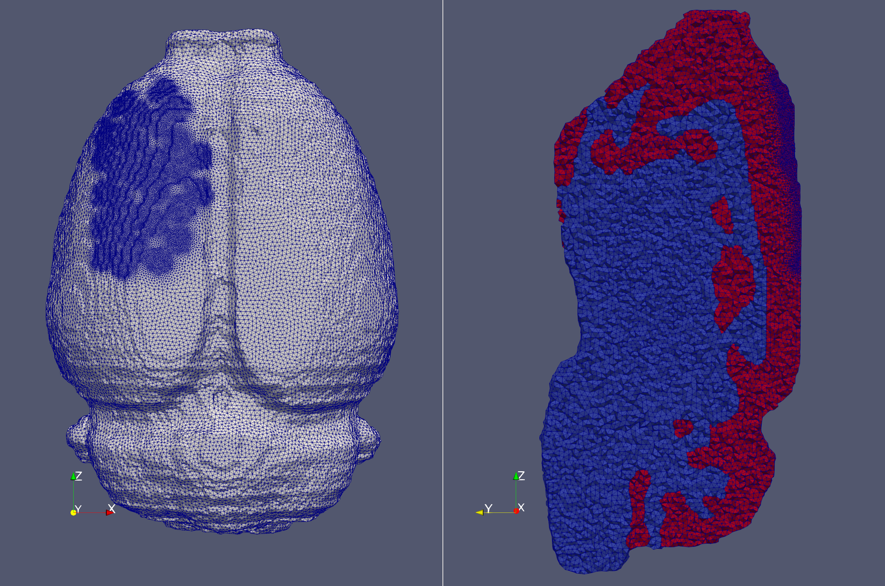
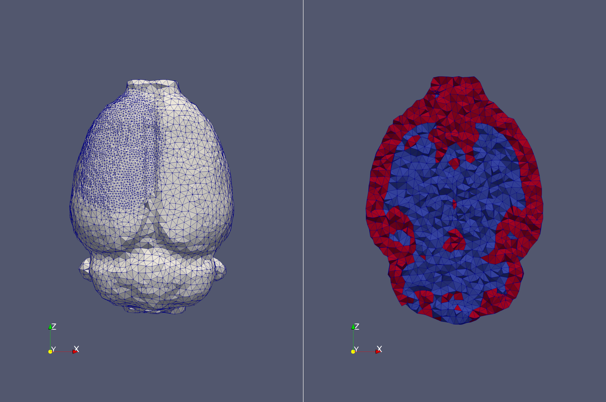

[](https://travis-ci.org/EIT-team/Mesher)
# EIT-Mesher

EIT-MESHER is C++ software, based on the CGAL library, which generates high quality Finite Element Model tetrahedral meshes from binary masks of 3D volume segmentations. Originally developed for biomedical applications in Electrical Impedance Tomography (EIT) to address the need for custom, non-linear refinement in certain areas (e.g. around electrodes), EIT-MESHER can also be used in other fields where custom FEM refinement is required, such as Diffuse Optical Tomography (DOT).



[Example Usage](./examples/readme.md)  
[Unit Cube - 'Hello World' example](./examples/unitcube/readme.md)  
[Meshing segmented brain data](./examples/brain/readme.md)  
[Meshing from STL file](./examples/neonatescalp/readme.md)  
[Mesh refinement examples](./examples/refinements/readme.md)  
[Mesh deformation](./examples/deformation/readme.md)

## Using the Meshes

Examples for using the EIT-MESHER outputs with common EIT and DOT solvers are given in [solvers examples](examples/solvers)

## Build instructions (tested on Ubuntu 16, 17, 18)

* Install dependencies

```bash
sudo apt-get install build-essential cmake libcgal-dev libcgal-qt5-dev libglu1-mesa libxi-dev libxmu-dev libglu1-mesa-dev
```

* Clone repository

```bash
git clone https://github.com/EIT-team/Mesher.git
```

* Make build & output directories

```bash
cd Mesher
mkdir build
mkdir output
```

* Compile

```bash
cd build
cmake ..
make
```

* Test

```bash
cd ../test/
./run_tests
```

* Run mesher ( from /Mesher root directory)

```bash
Usage:
./bin/mesher -i INPUT_INR -e INPUT_ELECTRODES -p INPUT_PARAMETERS
        -i input image file
        -e electrode position file
        -p parameter file
        -o output mesh name (default = new_mesh)
        -d output directory (default = output/)
```

Example:

```bash
./bin/mesher -i inputs/input.inr -e inputs/Electrodes.txt -p inputs/params.txt
```

Produces the following mesh as viewed in paraview



## Docker instructions (for Ubuntu 19&20+)

EIT-MESHER can be built in a container to install on newer linux installations. Windows users require WSL2 for docker to work.

### Install container

The docker container can be obtained using two different methods:

* Build container from source (`mesher` is a name of your choice):

```bash
docker build -t mesher .
```

* Pull image directly from dockerhub without having to build, renaming the container to `mesher` (or name of your choice) :

```bash
docker pull doctorjimbles/eit-mesher
docker image tag doctorjimbles/eit-mesher:latest mesher:latest
```

### Running Mesher from container

To test if it is working run the container with no inputs, this will call the mesher with defaults which runs the single example included in the container:

```bash
docker run --rm mesher
```

The `--rm` flag removes the container after its done to prevent having lots of unnecessary container IDs.

The mesher can then be called with the parameter arguments as normal **Note** these are files *inside* the container.

```bash
docker run --rm mesher -i inputs/input.inr -e inputs/Electrodes.txt -p inputs/params.txt
```

* Using your own data - mounting volumes

The container has two **root** directories `/in` and `/out` which can be mounted as volumes to map to directories on the host using the `-v` flag. So for example, if we had the `MESHER` repository in our home dir we would add the flags:

```bash
 -v ~/Mesher/inputs:/in -v ~/Mesher/output:/out
```

The mesher can then finally be called by combining the volume definitions and then directing the mesher at the new input location `/in/`. **Note** Parameters given must be with respect to the container file structure. So for example, to make the default mesh but using the inputs files in the repository on the host machine (assuming it is stored in /home/user/Mesher):

```bash
docker run --rm  -v ~/Mesher/inputs:/in -v ~/Mesher/output:/out  mesher -i /in/input.inr -e /in/Electrodes.txt -p /in/params.txt -d /out/ -o dockertest
```

This will result in an output mesh `dockertest` in `/home/user/Mesher/output`.

To run the NN scalp example (still assuming this repository is stored in /home/user/Mesher)

```bash
docker run --rm  -v ~/Mesher/examples/neonatescalp/:/in -v ~/Mesher/examples/neonatescalp/output:/out  mesher -i /in/NNscalp.inr -e /in/NNscalp_elecINRpos.txt -p /in/NNscalp_param.txt -d /out/ -o dockertestNN
```

* Improving slow file write on some systems

In some systems (reported on macOS 10.15.6, Docker Desktop 2.3.0.4, Docker Engine 19.03.12) it is much slower writing files into the mapped volume. Therefore to improve performance, it is possible to call the mesher and copy the files out afterwards. To do this we remove the `--rm` flag as we want to keep it, and add the `--name` flag to give it a name that makes more sense to us. We also drop the `-v` flag for the `\out` folder.

```bash
docker run --name NNmesher  -v ~/Mesher/examples/neonatescalp/:/in mesher -i /in/NNscalp.inr -e /in/NNscalp_elecINRpos.txt -p /in/NNscalp_param.txt -d /out/ -o dockertestNN
```

The mesher files can then be copied outside of the container

```bash
docker cp NNmesher:/out ./newoutputdir
```