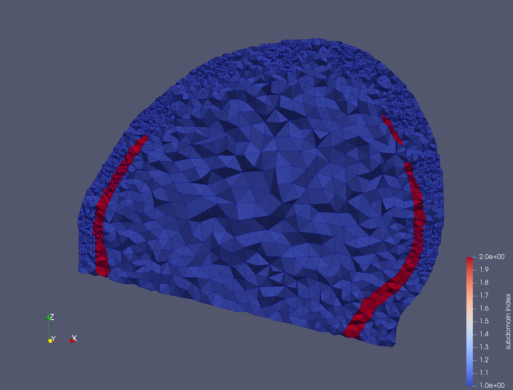
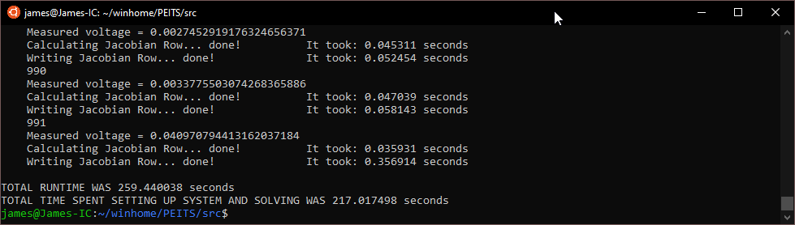
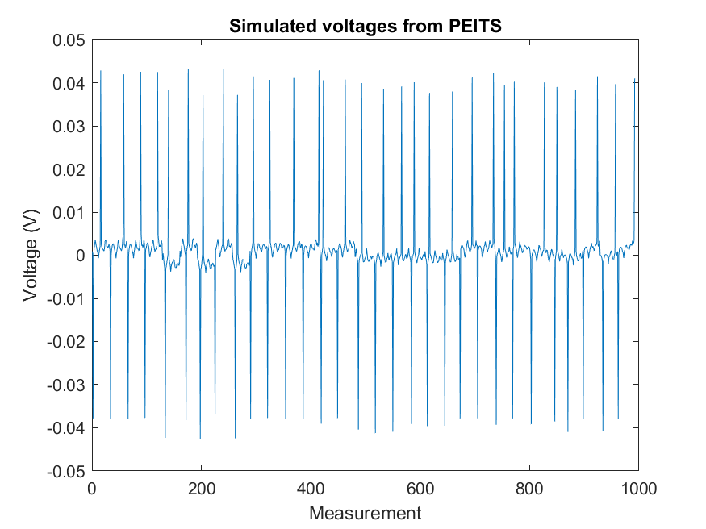

# PEITS example usage

[PEITS](https://github.com/EIT-team/PEITS) is a parallel EIT solver designed for high precision computation of the forward model in FEMs with a large number of elements. Both PEITS and MESHER run on Linux, as well as WSL. PEITS requires some specific files and parameters to be set in order to use the output from the MESHER, which are detailed here. The function `PEITS_example.m` also demonstrates how to use the MESHER and PEITS wrapper functions together for a simplified workflow

## 1. Run the Mesher

Here we are using the neonate skull as an example, with electrode and depth refinement to create a 500k element mesh.

```bash
../../bin/mesher -i ../neonatescalp/NNscalp.inr -e ../neonatescalp/NNscalp_elecINRpos.txt -p NNPEITS_param.txt -d output/ -o NNPEITSmesh
```



## 2. Prepare MESHER files

PEITS has numerous parameters, but MESHER assumes the simplest use case:

- Electrode nodes are chosen by PEITS and *not* specified directly `electrode.use_node_assignment: false`
- Conductivities are specified by a separate `conductivities` file, and the *indices* written to the `.dgf` file `fem.assign_conductivities: true`

Most of these settings are specified in the `MESHNAME.parameters` file written by the MESHER. However we will need to create the conductivities file.

The neonate mesh contains two layers, the scalp and skull so we need to write one per line:

```bash
echo $'0.2\n0.03' > output/NNPEITSmesh.conductivities  
```

The file `NNPEITSmesh.conductivies` now contains:

```bash
0.2
0.03
```

## 3. Setup PEITS

PEITS has a few idiosyncrasies that we need to account for. First it is easiest if the inputs are stored in the `PEITS/data` folder. Second that the same parameter file is read each time, so the contents must be overwritten each time.

Move the mesh files to `PEITS/data` creating a backup of the existing parameter files. This assumes MESHER and PEITS are located in the same root folder

```bash
cp ../../../PEITS/data/parameter ../../../PEITS/data/parameterBU #Backup parameterfile
cp parameter ../../../PEITS/data/parameter # copy parameter files
cp standardparamsNN ../../../PEITS/data/standardparamsNN

# only these files are needed for PEITS
cp output/NNPEITSmesh.dgf ../../../PEITS/data/NNPEITSmesh.dgf
cp output/NNPEITSmesh.parameters ../../../PEITS/data/NNPEITSmesh.parameters
cp output/NNPEITSmesh.electrodes ../../../PEITS/data/NNPEITSmesh.electrodes
cp output/NNPEITSmesh.conductivities ../../../PEITS/data/NNPEITSmesh.conductivities
```

The important settings within the `parameter` file are:

```bash
paramfile: ../data/standardparamsNN # "standard" parameter file
mesh: NNPEITSmesh # point to the correct files using `$(mesh)` variable
conductivities: ../data/$(mesh).conductivities
paramfile: ../data/$(mesh).parameters
current.protocol: ../data/NN2016_Prt_full.txt # EIT protocol
```

The `standard_params` file contains options that are not specific to a single mesh:

```bash
contact.impedance: 100 # needs to be integer
input.current: 240.0e-6 # in A
electrode.diameter: 8.0 # float in mm
```

## 4. Run PEITS

```bash
cd ../../../PEITS/src # move to PEITS src to run
mpirun -np 4 ./dune_peits # call PEITS with 4 nodes
```

This will calculate the forward solution in this mesh using the given parameters, giving the boundary voltages and jacobian. Subsequent runs can be sped up by setting `fem.io.loadPartitions: false`.



which yields the following boundary voltages.


