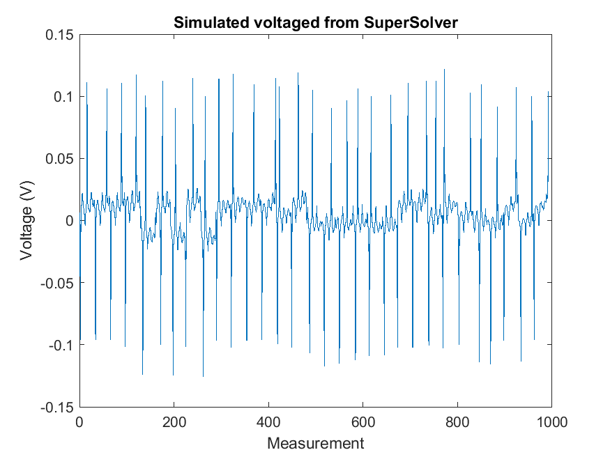

# SuperSolver Example

[SuperSolver](https://github.com/EIT-team/SuperSolver) is an older fork of [EIDORS](http://eidors3d.sourceforge.net/) which is simpler to use, although without many of the features added to EIDORS since. The function `supersolver_example.m` demonstrates its usage in the simple Neonate scalp mesh. Of the three EIT solvers it is the simplest to convert the MESHER output to the correct structure.

```matlab
M=loadmesh('output/NNSS');
% get the structures with defaults
[Mesh,Fem,Fwd,Inv,Sol] = supersolver_init(M.Nodes,M.Tetra,mat_ref,M.elec_pos,M.gnd_pos,Prt);

%change the electrode diameters etc.
Fem.current                         =   240e-6; % uA
Fem.elec_diam                       =   8e-3;% electrode diameter in meters
Fem.zc                              =   100 ; % contact impedance

%Setup system
[Mesh,Fem,Fwd,Inv,Sol] = supersolver_setup(Mesh,Fem,Fwd,Inv,Sol);
% run fwd
[Mesh,Fem,Fwd,Inv,Sol,Data] = supersolver_runfwd(Mesh,Fem,Fwd,Inv,Sol);
```

Produces the following voltages. Reconstructions can be created through either EIDORS or the [Reconstruction](https://github.com/EIT-team/Reconstruction) repository. A full pipeline example is given in [EITPipelineExample](https://github.com/EIT-team/EITPipelineExample)


