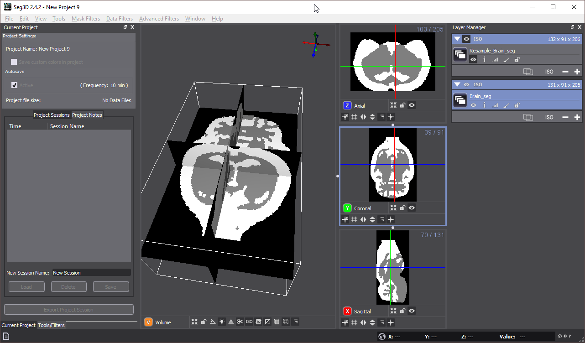
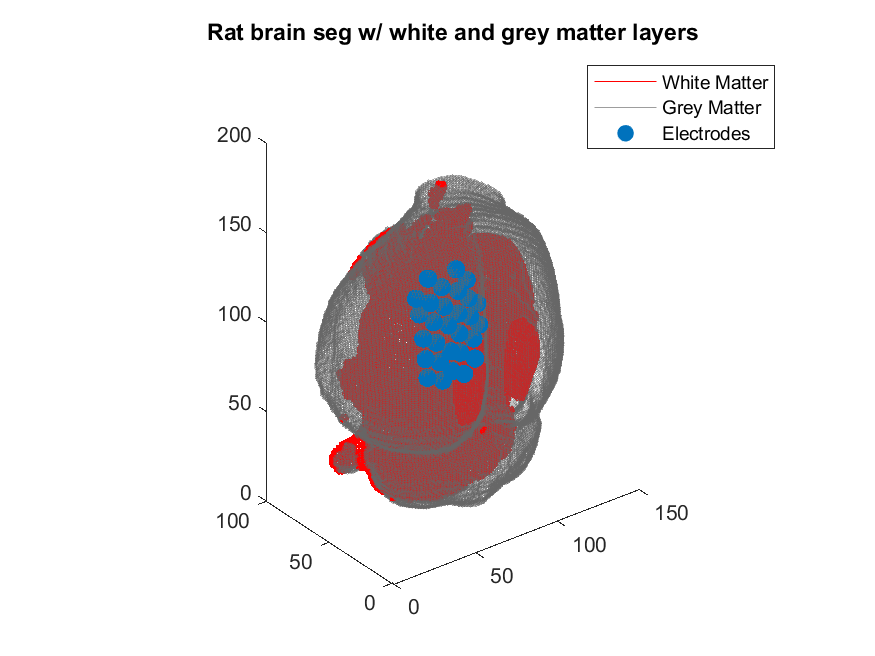
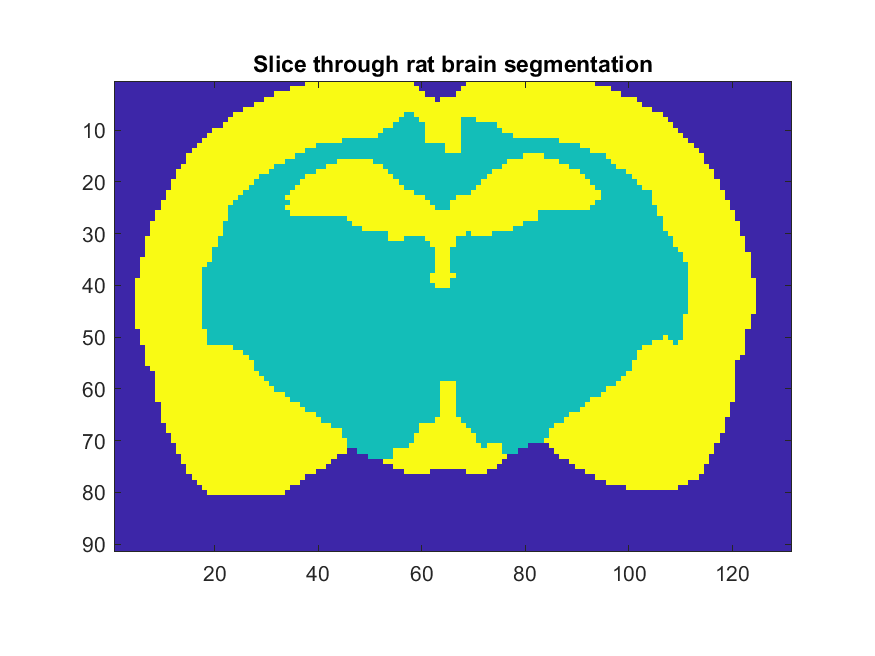
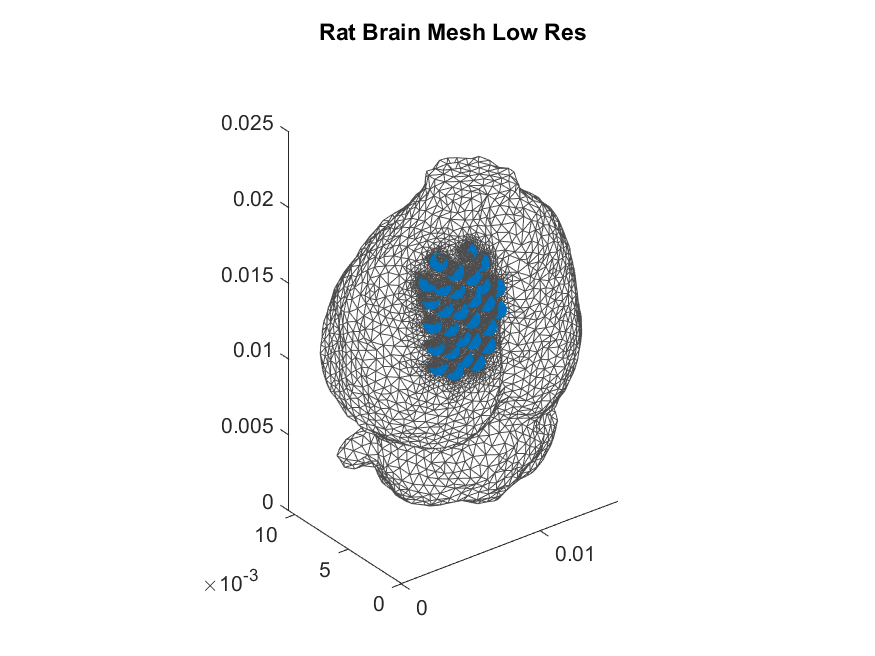

# Rat Brain Mesh

A typical use case is to create a mesh from an MRI/CT segmentation. Here we have a rat brain with the white and grey matter segmented as separate layers using [Seg3D](http://seg3d.org). In this example is important to **resample** the binary mask to have **uniform spacing** in the x y z directions. This makes defining electrode and refinement locations simpler.



Cortical electrode locations were defined within the INR coordinate space, as shown in `example_brain.m`.

 

## Run the mesher


```bash
../../bin/mesher -i Brain.inr -e Brain_elec.txt -p Brain_params.txt -d output/ -o BrainMesh
```


The electrode alignment and refinement regions are also clearly visible in MATLAB 




## High Resolution Mesh

