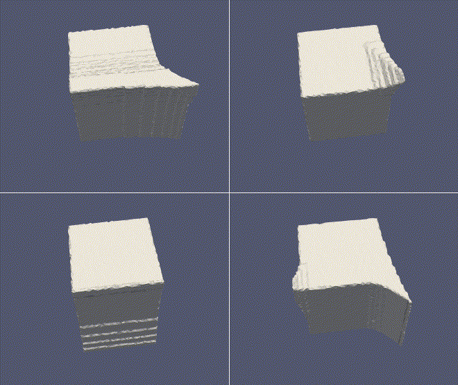
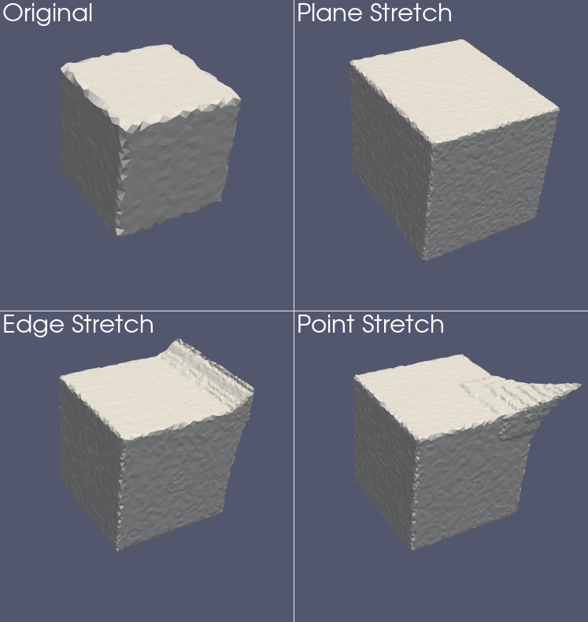

EIT-MESHER allows for some random deformations to be applied to the input data, before the output mesh is generated. It is not guaranteed to give 'sensible' meshes in every case, but can be ran repeatedly on the same input mesh to quickly generate a set of unique outputs.

Examples of deformation on unit cube:

Examples of deformation on human head mesh:

Two types of deformation are implemented.

**Stretching** - The mesh is 'pulled' in a random direction, by a random amount. For implementation detiails, see `src/deform_volume.cpp` and `src/mesh_stretcher.cpp`.  
**Dilation** - A layer in the mesh is dilated by expanding by one pixel on all sides.  The layer index is chosen at random.  Dilation is performed after stretching.

## Output filenames
In order to maintain unique filenames, the parameters of the stretch are appended to the output filename.
## Stretching parameters
`do_deformation = 1`  
Enables deformation, at least one stretching operation will be performed.

`min_stretch_distance = 5`  
`max_stretch_distance = 25`  
The stretch distance (mm) will be uniformly chosen bewteen these two values. This should be tweaked depending on the overall size of the mesh.

`stretch_probability = 0.5`  
A single stretch is always performed on the mesh. Further stretches will be performed with this probability. Each subsequent stretch occurs with the same probability. Higher values result in more streches.  
`dilate_probability = 0.33`  
Probability of a dilation happening. Each subsequent dilation occurs with the same probability. Higher values result in more dilations occuring.

`disable_xyz_stretch_probability = 0.5`  
The implementaiton of mesh stretching allows for the mesh to be 'pulled' along either a plane (equivlant to a linear scaling), an edge or through a single point:  
  
Which of these occurs is determined by randomly turning off stretching in each direction. If all three directions remain on, a point stretch will occur, if two directions are on, the stretch is along a line, and the stretch is along a surfce is only one direction is active.

`disable_xyz_stretch_probability` sets the probability of a direction being turned off. With the default value of 0.5, the probabilities for each type of stretch are:

Point - 1/8  
Line - 3/8  
Surface - 3/8  
All directions turned off (no stretch) - 1/8  
