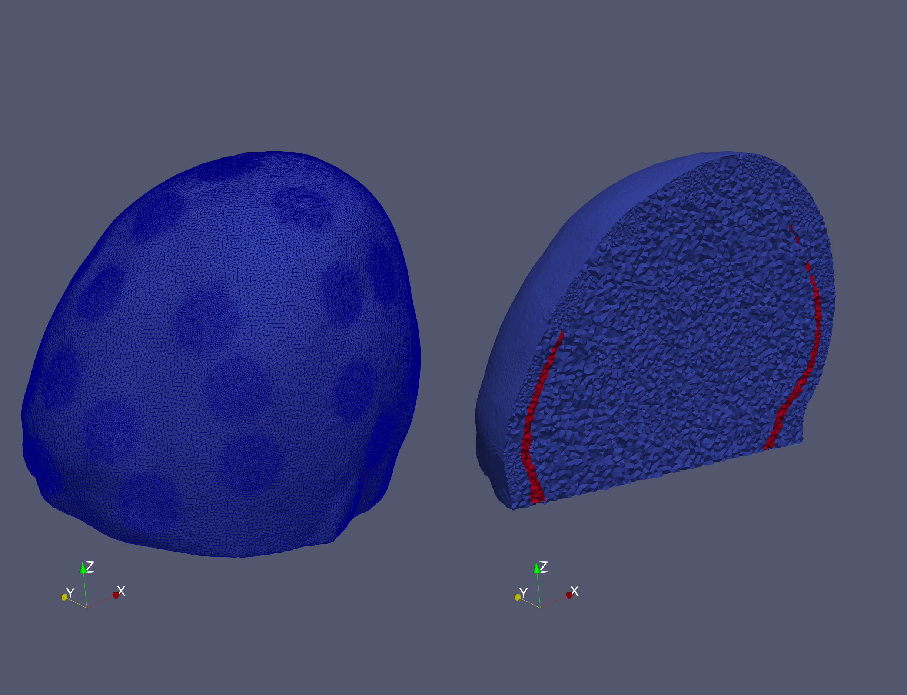

# Neonate scalp from CAD to Mesh

This example shows how to use the MESHER using a surface model `.stl` from a CAD application. This method was used to mesh the tanks in [this paperXXXXXXXXX](oidoidoid). This requires MATLAB and `iso2mesh` to be installed. The script `example_neonate.m` walks through the process of converting to inr and calling the mesher all through MATLAB.

## STL to INR

The input surface data will be converted into a volume mask using functions from `iso2mesh`. Each `.stl` file must contain only a single body, and each layer is voxelised on the same grid, and assigned a different binary value. The coordinate system will change, so the electrode positions are also transformed and stored in a new text file. The resolution of the output is specified by the `pixel_scale` option. 

```
elec_pos=dlmread('NNelecposorig.txt');
% run the conversion to INR. Plotting the figures to check the alignment of
% the electrodes and the quality of the output
[ full_mask,elec_pos_new_sc ] = stl2inr({'NNscalp.stl','NNskull_lowpoly.stl'},pixel_scale,elec_pos );
```


As the INR file has a new coordinate system, it is sensible to check the newly created positions are correctly aligned on the new mesh


## Run the Mesher - Low res

The initial parameter file was chosen to provide ~100k elements for demonstration and to check alignment and refinement settings, prior to running the final high resolution parameters. 

The MESHER can be called using the command below, or using the MATLAB wrapper as shown in `example_neonate.m`.

```
../../bin/mesher -i NNscalp.inr -e NNscalp_elecINRpos.txt -p NNscalp_param.txt -d output/ -o NNexample
```

## Check output 

Using paraview we can view the `.vtu` file we can check the output mesh as below. The regions of higher density around the electrodes are visible on the surface. Here we have changed the **representation** to **surface with edges** and **colouring** to **subdomain index**.  


Taking a slice/clip through the mesh we can see the boundaries of the skull (red) and scalp (blue) domains, as well as the depth of the electrode refinement.


Finally, we can check the output in MATLAB and ensure the electrode positions are maintained.

```
Mesh=loadmesh('output/NNexample');
figure
hold on;
trep = triangulation(Mesh.Tetra, Mesh.Nodes);
[Triangle_Boundary, Nodes_Boundary] = freeBoundary(trep);
h= trisurf(Triangle_Boundary, Nodes_Boundary(:,1), Nodes_Boundary(:,2), Nodes_Boundary(:,3));
set(h,'EdgeColor',[0.3,0.3,0.3],'FaceColor','w','FaceAlpha',1);
daspect([1,1,1]);
plot3(Mesh.elec_pos(:,1),Mesh.elec_pos(:,2),Mesh.elec_pos(:,3),'.','Markersize',40);
hold off
view(3)
title('Neonate Mesh Low Res')
```


## Final high res mesh

Once the parameters are established, the final ~4mln element mesh can be created. First we increase `pixel_scale` to 4 and repeat the stl2inr process for a more accurate starting geometry. The `cell_fine_size_mm`, `cell_coarse_size_mm` and `cell_size_electrodes_mm` parameters were reduced to create a denser mesh. Finally, the optimisations are all turned on with sufficient time to let them finish. This process takes ~20 minutes. 

```
../../bin/mesher -i NNscalp.inr -e NNscalp_elecINRpos.txt -p NNscalp_param_HR.txt -d output_HR/ -o NNexampleHighRes
```




