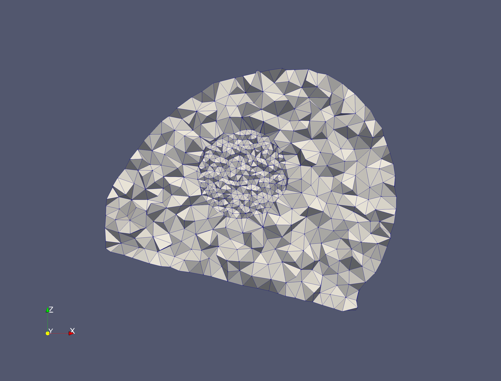

# Example meshes


The given examples have been tested on Ubuntu, either natively or running through Windows Subsystem for Linux.

The parameter used for each example are set to run quickly/produce small meshes, more realistic parameters, which will generate higher resolution meshes are also provided (e.g. Brain_params_HR.txt)

See `runexamples.m` for usage of the MATLAB wrappers.

## Unit Cube

 ```bash
 ../bin/mesher -i unitcube/unit_cube.inr -e unitcube/electrodes.txt  -p unitcube/input_idx.txt -o unitcubeexample -d unitcube/output/
 ```


## Neonate scalp

```bash
../bin/mesher -i  neonatescalp/NNscalp.inr -e neonatescalp/NNscalp_elecINRpos.txt  -p neonatescalp/NNscalp_param.txt -o NNexample -d neonatescalp/output/
```


## Brain

```bash
../bin/mesher -i brain/input.inr -e brain/Electrodes.txt -p brain/input_idx.txt -o brainexample -d brain/output/
```


## Refinements



## Deformation
