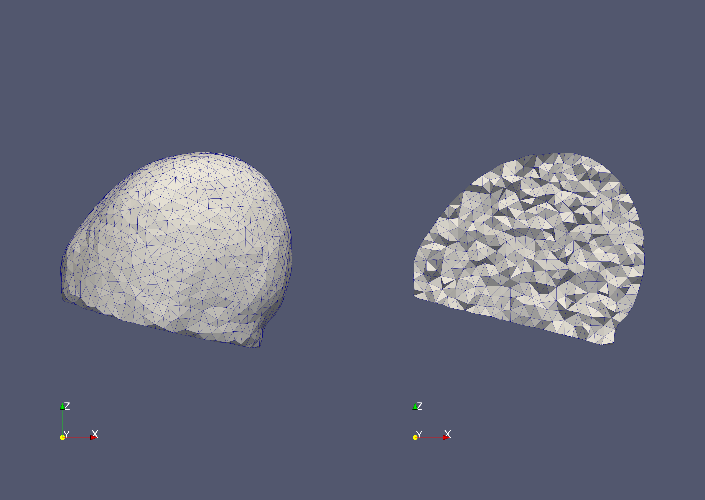

# Mesher refinement options

Here we explore the different methods of refining the mesh that are available to the user, and describe use cases for each. For simplicity we will be using a single layer mesh.

## 0. Initial Mesh - no refinement

Starting with an initial unrefined head mesh using `Params_0.txt`. All refinements are disabled by the setting the relevant flags to 0. The parameter `cell_coarse_size_mm` determines the baseline element size. The electrode file must be included even if the electrodes are not refined, as it required for the output mesh files.

```c++
facet_angle_deg = 30.000
facet_distance_mm = 2.000
cell_radius_edge_ratio = 3.000
cell_coarse_size_mm = 5.000
```

We have disabled optimisations for speed, but it is recommended to run the MESHER again with them turned on when you have found the settings you are happy with to smooth the transitions between element sizes.

```c++
electrode_refinement = 0
depth_refinement = 0
planar_refinement = 0
cuboid_refinement = 0
sphere_refinement = 0
```

Which can then be called with the following:

```bash
../../bin/mesher -i input.inr -e Elecs.txt -p Params_0.txt -o 0_Initial
```

Produces the following 25k element mesh with uniform element size:


## 1. Electrode refinement

Typically a higher mesh density is required at the electrodes due to the higher field gradients and increased sensitivity. This is achieved by increasing the sizing field value in a sphere around each electrode centre. The centres are specified in the `Elecs.txt` file, and the following options must be set in the parameter file:

```c++
electrode_refinement = 1
electrode_radius_mm = 5.000
cell_size_electrodes_mm = 2.000
```

The MESHER can then be called, and the and the denser regions are clearly visible in the output mesh.

```bash
../../bin/mesher -i input.inr -e Elecs.txt -p Params_1.txt -o 1_Elecs
```


## 2. Depth refinement

As the sensitivity decreases with distance from the electrodes, less elements are required towards the centre of the volume. Therefore, as outlined [a methods paper](https://doi.org/10.1088/0967-3334/35/6/1095) it is possible to specify a linear decrease from the surface to the centre. This is particularly useful in applications like the brain or thorax where the electrodes are limited to the outside surface, and are a significant distance from the centre of the mesh. 


adasdsdasd

```c++
elements_with_fine_sizing_field_percentage = 50.000
cell_fine_size_mm = 5.000
cell_coarse_size_mm = 5.000
```

The mesher can then be called:

```bash
../../bin/mesher -i input.inr -e Elecs.txt -p Params_2.txt -o 2_Depth
```

The gradient 


## 3. Sphere refinement

A separate sphere anywhere in the mesh, separate from the electrodes, can be defined through the following parameters:

```c++
sphere_refinement = 1
sphere_radius = 20.000
sphere_centre_x = 60.00
sphere_centre_y = 50.00
sphere_centre_z = 60.00
sphere_cell_size = 2.000
```

All inputs are specified in mm, and are in the coordinates of the final mesh *i.e.* not scaled by vx,vy,vz. Defining the element size within a volume like this is useful either to 1) *increase* the mesh density around internal electrodes like [this study](https://doi.org/10.1016/j.neuroimage.2018.05.022), or 2) to explicitly decrease mesh density in the centre similar to depth refinement.

```bash
../../bin/mesher -i input.inr -e Elecs.txt -p Params_3.txt -o 3_Sphere
```


## 4. Cuboid refinement

A cuboid of constant element size can also be defined in the same manner as the sphere. All inputs are in mm with respect to the final mesh (not scaled by vx,vy,vz). "Extent" is the distance along one axis from the centre to the edge, so the cube in this case has WxLxH of 60x20x20.

```c++
cuboid_refinement = 1
cuboid_x_extent = 30.000
cuboid_y_extent = 10.000
cuboid_z_extent = 10.000
cuboid_centre_x = 60.00
cuboid_centre_y = 50.200
cuboid_centre_z = 60.900
cuboid_cell_size = 2
```

```bash
../../bin/mesher -i input.inr -e Elecs.txt -p Params_4.txt -o 4_Cuboid
```


## 5. Planar refinement

**Note, it is not recommended to use planar and depth refinement at the same time.**

Planar refinement creates a gradient along a single dimension specified by `planar_direction_xyz`. This is useful in similar applications to the depth refinement, except the electrodes are only on a single surface of the mesh, such as the rat brain. The sizing field decreases from `cell_fine_size_mm` at the plane specified by `height` to `cell_coarse_size_mm` at a distance `xdim` away from this plane. It is possible to specify a region that is fixed to `cell_fine_size_mm` through the `elements_with_fine_sizing_field_percentage` parameter, after which the gradient starts. For example the parameters below creates a gradient from 2 to 5 mm along the z axis, with 10% of the distance fixed at 2mm.  

```c++
planar_refinement = 1
cell_coarse_size_mm = 5.000
cell_fine_size_mm = 2.000
elements_with_fine_sizing_field_percentage = 10.000
height = 0.000
planar_direction_xyz = 3.000 // Dimension x = 1, y = 2, z = 3
```

```bash
../../bin/mesher -i input.inr -e Elecs.txt -p Params_5.txt -o 5_Planar
```

The gradient is clear within the mesh, and using `figures/Sizing_fields.m` the sizing field itself can be visualised:

 

The plane is specified at `height = 0`, with 10 % of the mesh height fixed at `cell_fine_size_mm` before increasing linearly towards `cell_coarse_size_mm`. The gradient is symmetric about the plane specified by `height` so this value must be chosen carefully to avoid undesirable results. For example to create a gradient in the opposite directions, the `height` should be specified at the top of the mesh:

 