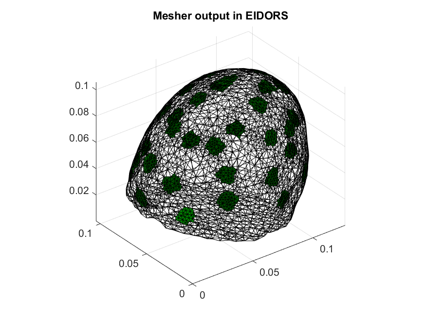
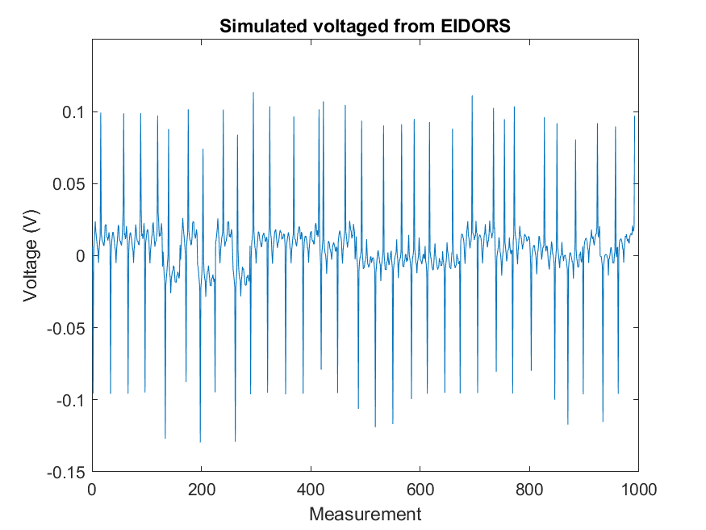

# Read MESHER output into EIDORS

[EIDORS](http://eidors3d.sourceforge.net/) is the most common EIT software suite, which offers some meshing capabilities through Netgen and Distmesh. EIDORS is based on MATLAB/Octave and a full example is given in `eidors_example.m`.

## Loading mesh

First call MESHER to create a low resolution neonatal head mesh. If you are using >1 mln elements then [PEITS](https://github.com/EIT-team/PEITS) probably better suited.

```bash
../../../bin/mesher -i ../../neonatescalp/NNscalp.inr -e ../../neonatescalp/NNscalp_elecINRpos.txt -p NNEIDORS_param.txt -d output/ -o NNEIDORS
```

EIDORS contains a number of useful utilities to create a valid EIDORS FEM object, and this code is based on `mk_fmdl_from_nodes.m`. EIDORS requires:

- Nodes and Vertices
- Surface faces
- Ground node
- Electrode nodes

Once these have been defined we can use the EIDORS function `show_fem(MDL)` to plot the mesh



## Running forward solution

The protocol can be converted to an EIDORS stim pattern through `stim_meas_list` and the forward model setup through `img = mk_image(MDL,cond);`. Finally the voltages can be calculated using `fwd_solve`.


