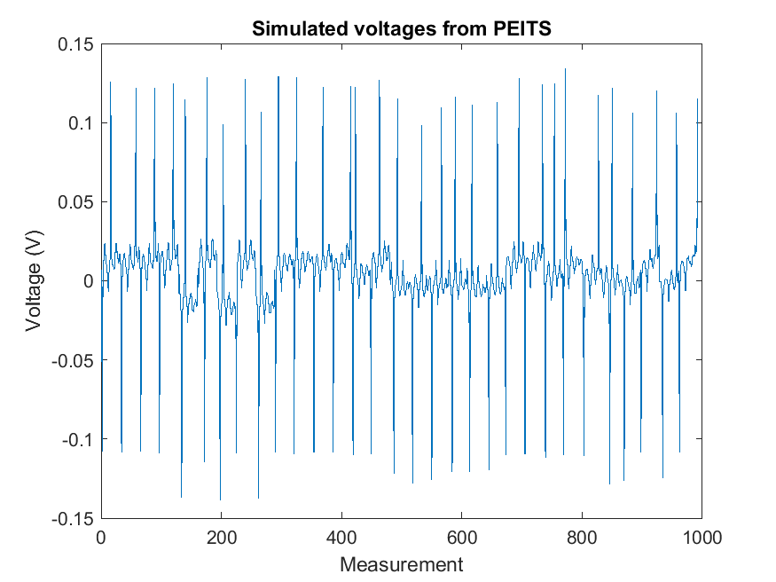
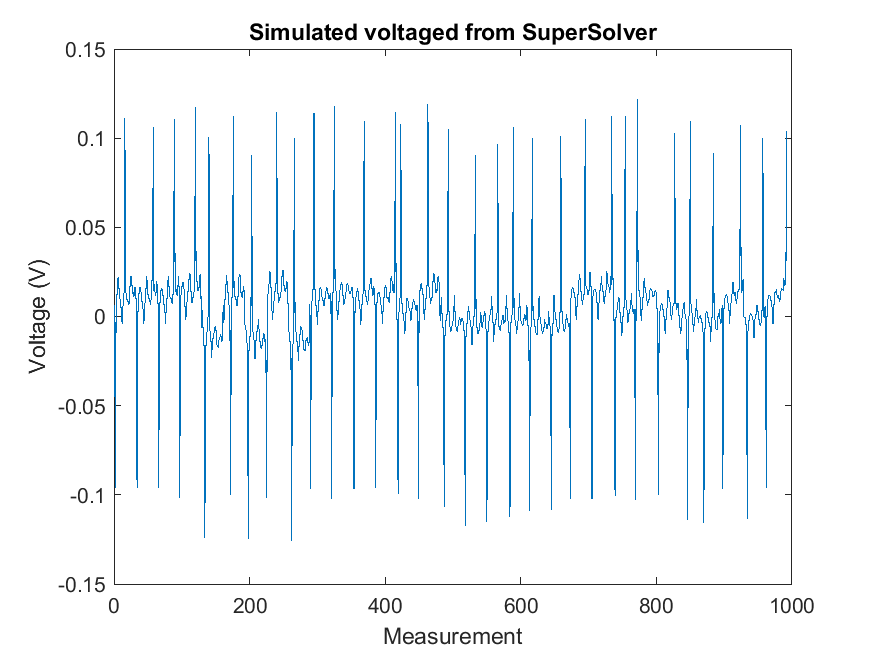
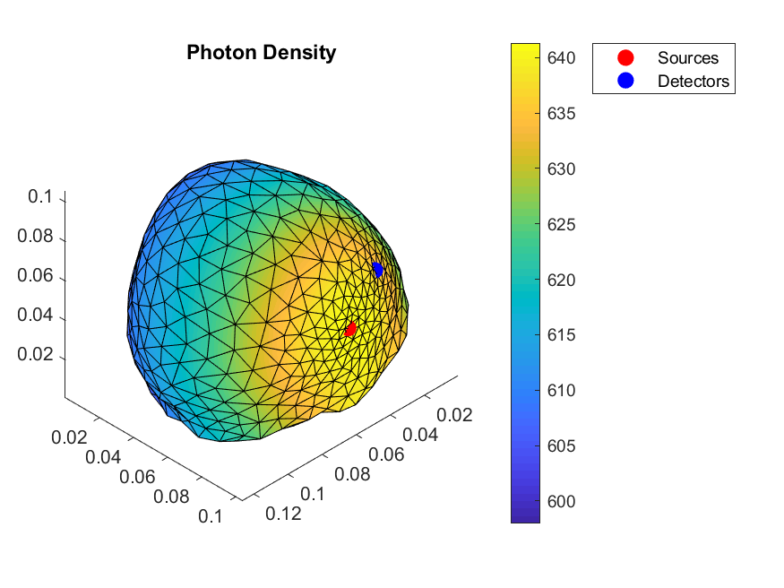

# Using the MESHER output

- [PEITS](PEITS/readme.md) a fast parallel EIT solver
- [EIDORS](EIDORS/readme.md) the most common EIT MATLAB software suite
- [SuperSolver](SuperSolver/readme.md) simplified EIDORS with only core functions
- [Toast++](toast/readme.md) Software suite for DOT

Example EIT voltages from the three different forward model calculations

Photon density for a single source detector pair in TOAST++

