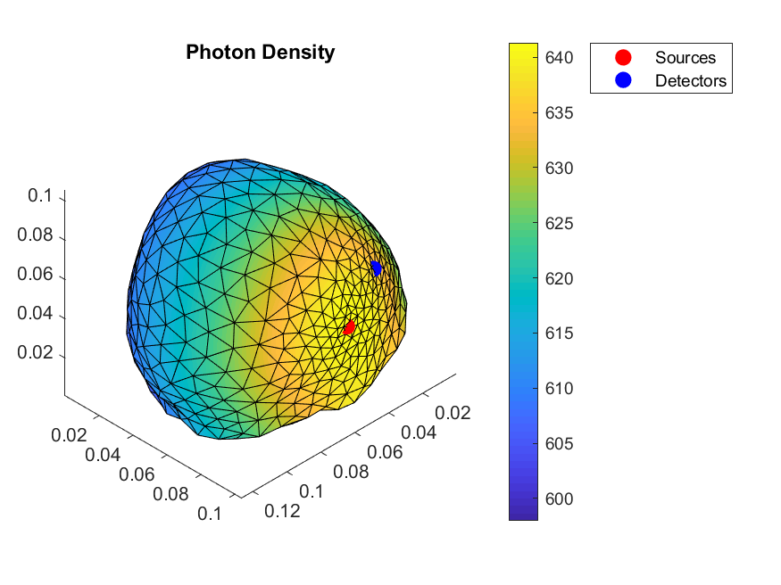
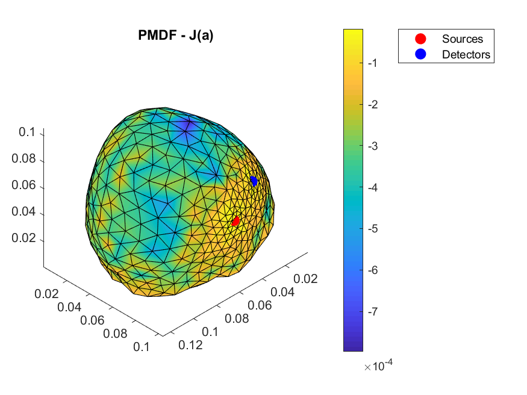

# Load MESHER output into TOAST++

[Toast++](http://web4.cs.ucl.ac.uk/research/vis/toast/) is an image reconstruction software suite for Diffure Optical Tomography (DOT). The FEM meshes created by the MESHER are well suited to the DOT problem as the mesh requires refinement around the sources and detectors. The MATLAB function `mesher2toast.m` details how to create a suitable mesh and convert it to a `toastMesh` before running a simple forward model for a single source/detector pair.

```matlab
%Mesher Structure
MM=loadmesh('output/ToastEx');

%Toast Structure
Tmesh = toastMesh (MM.Nodes,MM.Tetra(:,1:4),3*ones(size(MM.Tetra,1),1)); % 3 for 4 sided tetra
```

 
