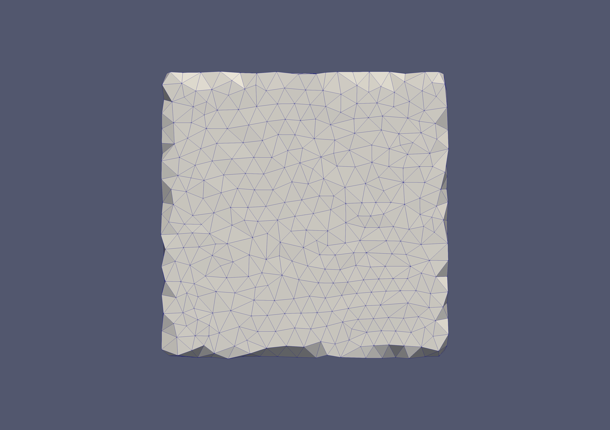
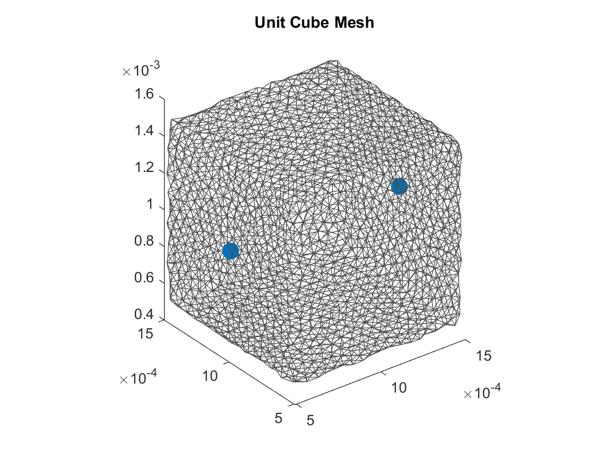

# Unit Cube Mesh

A simple unit cube serves a `Hello World` example mesh. This is useful to check the MESHER functionality, and a sanity check for any INR to DGF coordinate transformations. 



``` 
../../bin/mesher -i unit_cube.inr -e electrodes.txt -p Params_0.txt -o 0_Cube
```

THe parameters within `Params_0.txt` create a low element mesh with no optimisations. Turning on the optimisations by setting `lloyd_opt = 1` `odt_opt = 1` `exude_opt = 1` `perturb_opt = 1` creates a more regular mesh which also captures the boundaries better. 

``` 
../../bin/mesher -i unit_cube.inr -e electrodes.txt -p Params_1.txt -o 1_CubeOpt
```


This can then be displayed in Matlab

```
Mesh=loadmesh('output/1_CubeOpt'); %requires tetra to be saved

%find the surface triangles and create triangulation
trep = triangulation(Mesh.Tetra, Mesh.Nodes);
[Triangle_Boundary, Nodes_Boundary] = freeBoundary(trep);

figure
hold on;
%plot surface mesh
h= trisurf(Triangle_Boundary, Nodes_Boundary(:,1), Nodes_Boundary(:,2), Nodes_Boundary(:,3));
set(h,'EdgeColor',[0.3,0.3,0.3],'FaceColor','w','FaceAlpha',0);
daspect([1,1,1]);
%add electrodes
plot3(Mesh.elec_pos(:,1),Mesh.elec_pos(:,2),Mesh.elec_pos(:,3),'.','Markersize',40);

hold off
view(3)
title('Unit Cube Mesh')

```

